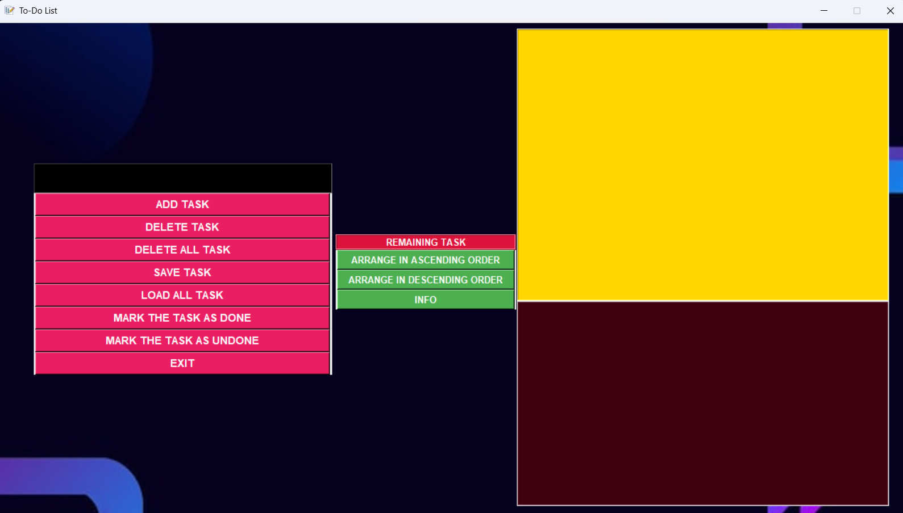

# TODO List Application

This is a simple TODO List application created using Python and Tkinter. The application allows you to add, delete, and mark tasks as done or undone. It also provides functionalities to save and load tasks from a file and to sort tasks in ascending or descending order.

## Features

- **Add Task**: Add a new task to the TODO-List.
- **Delete Task**: Delete a selected task from the TODO-List.
- **Delete All Tasks**: Delete all tasks from the TODO-List.
- **Mark as Done**: Mark a selected task as done.
- **Mark as Undone**: Unmark a selected task as done.
- **Save Tasks**: Save all tasks to a file.
- **Load Tasks**: Load tasks from a file.
- **Sort Tasks**: Sort tasks in ascending or descending order (alphabetically).
- **Remaining Tasks Counter**: Display the number of remaining tasks.
- **Info**: Show information about the application.
- **Exit**: Exit the application.

## Usage

1. **Add Task**: Enter the task in the input field and click the "ADD TASK" button.
2. **Delete Task**: Select a task from the list and click the "DELETE TASK" button.
3. **Delete All Tasks**: Click the "DELETE ALL TASK" button to delete all tasks.
4. **Mark as Done**: Select a task from the list and click the "MARK THE TASK AS DONE" button.
5. **Mark as Undone**: Select a task from the "Completed Tasks" list and click the "MARK THE TASK AS UNDONE" button.
6. **Save Tasks**: Click the "SAVE TASK" button to save the tasks to a file.
7. **Load Tasks**: Click the "LOAD ALL TASK" button to load tasks from a file.
8. **Sort Tasks**: Click the "ARRANGE IN ASCENDING ORDER" or "ARRANGE IN DESCENDING ORDER" button to sort tasks alphabetically.
9. **Info**: Click the "INFO" button to show information about the application.
10. **Exit**: Click the "EXIT" button to exit the application.

## File Structure

- `todo_list.py`: The main application file.
- `Background.png`: The background image for the application.
- `favicon.ico`: The icon for the application window.
- `file.txt`: The file where tasks are saved (created automatically when saving tasks).
- `screenshots/`: Folder containing application screenshots.

## Requirements

- Python (Compatible with 3.x)
- Tkinter (Python GUI Library, comes pre-installed with Python)

## Installation

1. Clone this repository:
   ```bash
   git clone https://github.com/gourabroyofficial/TODO-LIST.git
   ```
2. Navigate to the project directory:
   ```bash
   cd todo-list
   ```
3. Run the application:
   ```bash
   python todo_list.py
   ```

## Screenshots

Here is a preview of the application:



## Author

- Created by Gourab Roy


